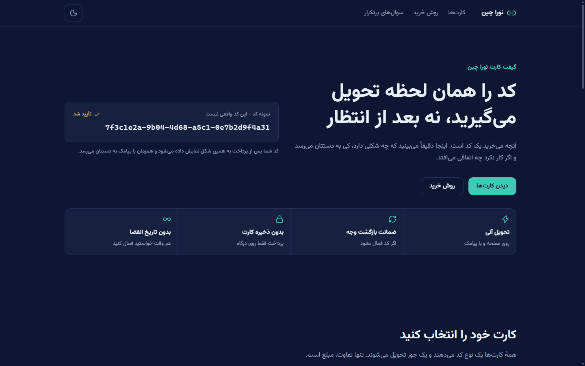
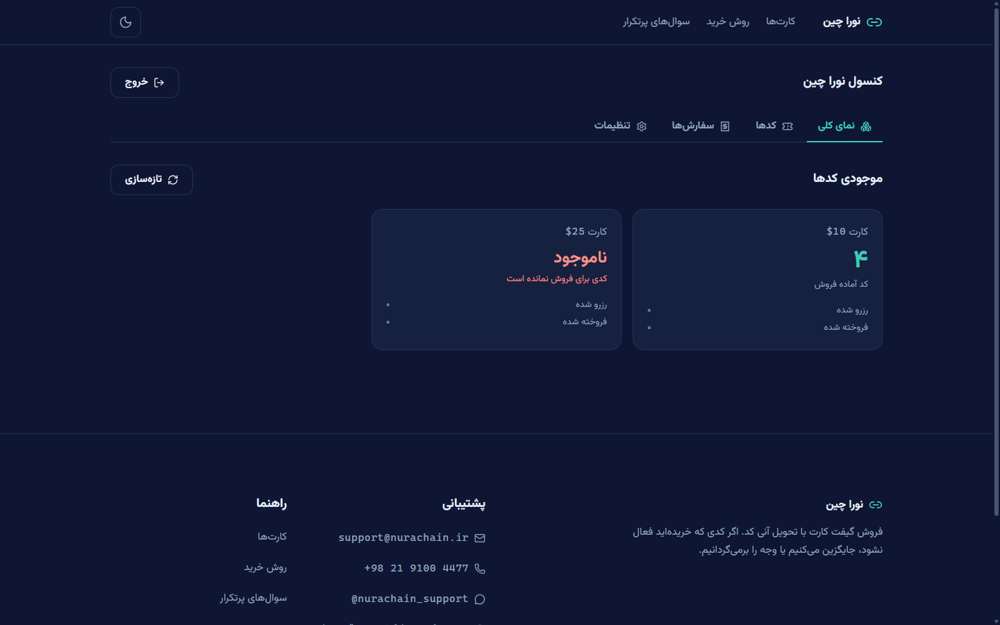
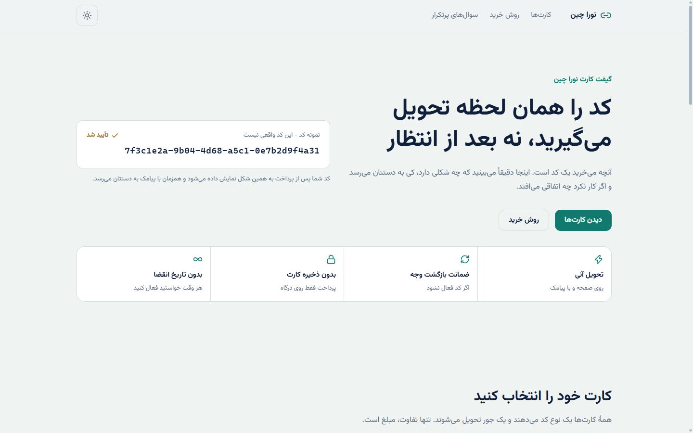
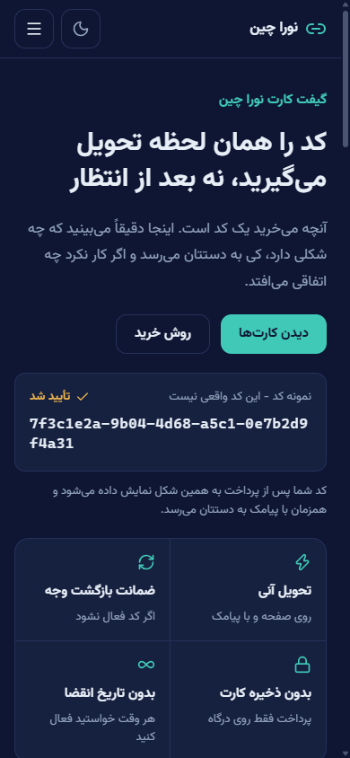

# nura-chain

[](https://github.com/NuraChain/GiftCard/actions/workflows/ci.yml)
[](https://github.com/AzerothJS/AzerothJS)
[](https://nodejs.org)

A gift-card shop built on [AzerothJS](https://github.com/AzerothJS/AzerothJS):
`application/` (compiled `.azeroth` components on vite) + `server/`
(`@azerothjs/http`, no build step) - one command runs both.

A buyer picks a denomination, types a phone number, confirms it, pays on Zarinpal, and
comes back to a gift code that is also sent by SMS. An operator loads codes and watches
orders from `/admin`.

<div align="center">



| | |
| --- | --- |
|  |  |



</div>

## How a purchase works

1. `POST /api/pay/start` claims one code from stock **inside a transaction** and opens a
   Zarinpal payment. Sold out means a 409 before the buyer ever reaches the bank.
2. Zarinpal returns the buyer to `GET /api/pay/callback`.
3. That route **always** calls `payment/verify.json` with the amount from OUR stored row.
   Only a 100 or 101 back from Zarinpal pays the order out.
4. The code is delivered on screen and sent through Kavenegar's Lookup API.

### The four rules the code enforces

- **`Status` in the return URL decides nothing.** It is a string anyone can type - including
  `Status=NOK`, which would otherwise be a free way to cancel a stranger's order and release
  their code. Verification is the only authority; `Status` only picks the wording when
  verification fails.
- **The amount comes from our record.** Sending back an amount the caller supplied is how a
  five-dollar payment becomes a twenty-five-dollar card.
- **A code is handed out once.** Zarinpal answers `101` on every repeat verify, which is what
  a browser refresh produces, so a replayed callback returns the SAME code and takes nothing
  further from stock.
- **Secrets stay out of logs and out of responses.** The merchant id, the API key, the admin
  key, the phone and the code are in the logger's `redact` list, and the console API returns a
  credential only as its last four characters - a stolen session can overwrite one but never
  read one out.

There is a fifth rule that used to be a TYPE. The denominations were `5 | 10 | 25`, so "an
unlisted amount is a forged request" was enforced by the compiler. The catalogue is editable
now, so that check moved to where it can still be made: `pay.start` looks the amount up in the
live tier table and refuses anything missing or inactive, before a code is claimed or a
gateway is called.

## The canon tour (what this app demonstrates)

| Piece | Where | The idea |
| --- | --- | --- |
| ONE route table | `application/src/routes.ts` | The router's own table IS the manifest - plus one `render:` field per route ('static' / 'server' / 'client') |
| Client routing | `application/src/App.azeroth` | `<RouterProvider>` + `<Routes>` over that table; `useRoute()` swaps the chrome for the console |
| ONE wire vocabulary | `server/src/schemas.ts` | Every wire shape declared once and imported by BOTH halves; client-safe by construction |
| Colocated routes | `server/src/features/*/feature.ts` | `feature()` - method, path, schemas, guard and handler in one expression, so a handler cannot drift from its route |
| Typed API client | `application/src/lib/api.ts` | `createClient<Api>(manifest)` - typed from the server's own declaration, inputs validated BEFORE the wire |
| Schema-validated form | `application/src/components/purchase-panel.azeroth` | The `form` keyword with the SAME phone schema the server enforces |
| Boundary validation | `server/src/app.ts` | `register` - a forged request gets the 422 whose field map the form displays |
| Typed guards | `server/src/app.ts` | One `requireAdmin` over the whole admin feature; the two ways past it are `routes.with(...)` at the route |
| Feature-first server | `server/ARCHITECTURE.md` | One folder per feature - shapes, routes, rules and SQL together - with the money rules in `features/checkout/checkout.ts` |
| SSR and hydration | `application/src/entry.server.ts` + `main.azeroth` | The shop renders per request because its catalogue is editable; the console renders in the browser only |
| One-origin deploy | `server/src/main.ts` (`mountPages`) + `server/Dockerfile` | One container serves API + pages + assets |

## Scripts (from this root)

| Command | Does |
| --- | --- |
| `npm run dev` | BOTH halves under one banner: the server on :3000, vite on :5173 with `/api` proxied |
| `npm test` | the server suite: the whole payment flow against in-memory SQLite and injected fakes |
| `npm run check` | every gate: server `tsc --noEmit` + eslint, client `azeroth-tsc` + eslint |
| `npm run build` | client bundle, SSR bundle, prerender (the server has no build step - by design) |
| `npm start` | production: the server serves the API **and** the built client - one origin |

## Running the operation

### Before the first sale

The shop runs with no configuration at all. Everything is set from the console.

1. Start it. The first boot prints a console credential ONCE:
   ```
   Console credential for this installation (shown once):

       TE7P-WCS2-CRNZ-Z4R9
   ```
   Only its hash is stored, so that line is the only time it can be read. No default is
   shipped - a default in a public repository is a published credential. Set `ADMIN_KEY`
   yourself if a deployment pipeline needs to know it in advance.
2. Sign in at `/admin` and rotate the key from the settings tab to one you chose.
3. On the same tab, set the Zarinpal merchant id. Checkout refuses to start a payment until
   one exists - booting is not the same as being open for business.
4. Optional: add the Kavenegar key and the name of an APPROVED Lookup template containing
   `%token`, then use "send a test SMS" to prove it works. Leave them empty and delivery is
   simply off; the buyer still gets their code on screen.
5. Set your prices, add or remove denominations, and paste the codes your supplier gave you -
   one UUID per line. Nothing is for sale until there is stock, and each card says so.

### Testing without real money

On the settings tab, set the gateway address to `https://sandbox.zarinpal.com` and use any
UUID as the merchant id. Same v4 endpoints, no account, no real money - the tab shows
"حالت آزمایشی" when it detects the sandbox host. Sandbox authorities begin with `S`, which is
how you tell a test payment from a real one in the ledger.

### Every day

- The console's top row is the number that matters: codes available per denomination. At
  zero the card goes unbuyable rather than taking money it cannot honour.
- The **کدها** section is the inventory audit: every code you loaded, whether it is free,
  held by a checkout in flight, or sold - and to which phone number. Filter by state or
  denomination, search by part of a code or by the buyer's number. Codes stay masked until
  you ask for one, so a screenshot of this page is not a copy of your stock.
- **`پرداخت شده` with `کد داده نشده`** is the one row that needs a human: the money verified
  and no code was free at that moment. Those rows pin to the top of the ledger. Send the
  buyer a code or refund them, using the reference shown.
- Search the ledger by phone (`0917...`, `917...`, `+98...` or a fragment), by code, or by
  the bank reference.

### The database

`DATABASE_FILE` (default `server/data/nura.db`) holds the code inventory, the order ledger,
the catalogue and the settings.

**Treat that file as the business.** It holds unsold codes, which are money, and the
credentials of the account they are paid into, stored as given - there is no encryption at
rest, because a key kept beside the ciphertext protects nothing and pretending otherwise is
worse than being clear. Back it up, and never put it on a disk a redeploy wipes.

`server/ARCHITECTURE.md` explains the layout; `Store` in `server/src/db/` is the seam if you
outgrow SQLite.

## How the halves talk

- **Dev**: vite serves the client and proxies `/api` to the server
  (`application/vite.config.ts` - the whole wiring is that one visible line). Set
  `PUBLIC_BASE_URL` to the **vite** origin in dev, because that is where the buyer's browser
  is when the gateway sends them back.
- **Production**: the server serves `application/dist` itself (`CLIENT_DIR`), so the deployed
  app is ONE origin - no CORS between your own halves, ever.

## Configuration

Copy `server/.env.example` to `server/.env`. Every key the server reads is listed there; keep
the two files in step. Note what is NOT here: the gateway and SMS credentials live in the
console and in the database, because two places to set one value is a trap.

| Key | Default | What it does |
| --- | --- | --- |
| `PORT` | `3000` | Server port |
| `NODE_ENV` | `development` | `production` serves the built client |
| `CLIENT_DIR` | `../application/dist` | Built client, served from the same origin |
| `SSR_ENTRY` | `../application/dist-server/entry.server.js` | SSR bundle |
| `PUBLIC_BASE_URL` | `http://localhost:3000` | Where the gateway returns the buyer. A wrong value strands every payment |
| `DATABASE_FILE` | `data/nura.db` | Gift codes and the order ledger. Back it up like money |
| `ADMIN_KEY` | *(unset)* | Optional override for the console credential. Leave it unset and the first boot mints one and prints it once |

## Deploy

One container for the whole app (stage 1 builds the client, stage 2 runs the server and
serves it):

```sh
docker build -f server/Dockerfile -t nura-chain .
docker run -p 3000:3000 -v nura-data:/app/data nura-chain
```

**The volume path matters.** Inside the image the database lives at `/app/data`, which is
where `DATABASE_FILE` points and what the image declares as a volume. Mounting anything else
leaves the real database in the container's writable layer, where the next deploy destroys it
along with every unsold code in it.

The image runs as the unprivileged `node` user and carries a healthcheck against
`/api/healthz`.

`/api/healthz` answers orchestrator probes. CI runs the same gates you run locally
(`.github/workflows/ci.yml`): check, build, test.

## Admin access, stated plainly

The console key is a shared bearer credential: whoever holds it is the admin, there is no
second factor, and there is no per-person attribution in the ledger.

What is done about that: it is stored as a scrypt hash and compared in constant time, sign-in
attempts are locked out per IP, the browser only ever holds an opaque `HttpOnly` session
cookie, rotating it requires the current key and closes every open session, and a fresh
install mints its own rather than shipping a default. None of that changes what the key is.
Treat it like a root password.

And note what the key can do now that the console owns the configuration: whoever holds it can
change the merchant id, which is where the money goes. That is the trade for being able to run
the shop without a deploy.

## Tailwind CSS

This app was scaffolded with `--tailwind`: Tailwind v4 through `@tailwindcss/vite` (no
PostCSS config) in the application half. `application/src/styles.css` maps the design tokens
to utilities via `@theme inline`, so components style themselves inline and stay on the same
palette in light and dark.

## Replace before launch

These values are MOCK data so the page reads as a finished product. Every one is in
`application/src/content.ts` (`CONTACT`) unless noted.

| Value | Current mock |
| --- | --- |
| Support email | `support@nurachain.ir` |
| Support phone | `+98 21 9100 4477` |
| Telegram handle | `@nurachain_support` |
| Operating entity | `شرکت داده‌پردازی نورا زنجیره` |
| Support hours | `هر روز، ۹ صبح تا ۹ شب به وقت تهران` |
| Sample gift codes | `TIERS[].sample`, and the hero code in `pages/landing.azeroth` |

The sample codes are labelled on the page as samples ("نمونه کد - این کد واقعی نیست") and are
not redeemable.

**What is deliberately absent, and should stay absent unless it becomes true:** review
counts, star ratings, testimonials, security certifications, compliance badges, partner
logos, and customer totals. Contact details are replaceable content; invented credentials are
what a scam site manufactures, and adding them would undo the page's actual job.
